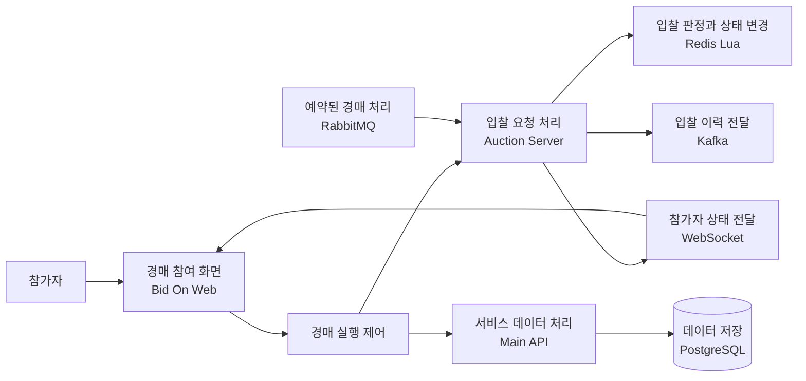

# Bid On

동시에 들어오는 입찰 요청을 안전하게 처리하고, 변경된 경매 상태를 여러 참가자에게 실시간으로 전달하는 인터랙티브 경매 시스템입니다.

직접 입찰하거나 가상 참가자를 추가해 동시 입찰 처리 과정과 최종 결과를 확인할 수 있습니다.

[▶ 실시간 경매 직접 체험하기](https://bidon-performance.duckdns.org/) · [3분 프로젝트 요약](docs/00-프로젝트-요약.md) · [시스템 구조 보기](docs/02-시스템-아키텍처.md)

## 2분 안에 확인할 수 있는 것

1. `새 테스트 시작`으로 경매를 준비합니다.
2. 원하는 금액을 입력하고 `직접 입찰하기`를 누릅니다.
3. 가상 참가자 수, 입찰 속도와 패턴을 설정합니다.
4. `가상 입찰 시작`으로 여러 요청이 처리되는 과정을 확인합니다.
5. 참가자 카드의 현재가, 최고 입찰자와 Version이 함께 갱신되는지 확인합니다.
6. 체험 결과에서 응답 시간, 처리량과 참가자 상태 일치 여부를 확인합니다.

[빠른 시작에서 화면별 확인 지점 보기](docs/01-빠른-시작.md)

## 프로젝트 소개

Bid On은 실시간 경매의 동시성 문제와 여러 참가자 간 상태 동기화를 다루기 위해 개발한 경매 시스템입니다. 여러 요청이 비슷한 시점에 도착해도 최고가와 최고 입찰자가 일관되게 결정되도록 입찰 조건 확인과 상태 변경을 Redis Lua의 한 실행 안에서 처리합니다.

반영된 결과는 WebSocket으로 참가자에게 전달됩니다. Kafka는 입찰 이력의 비동기 전달을, RabbitMQ는 예약된 경매 시작과 종료 작업의 전달을 담당합니다. 웹 화면에서는 직접 입찰과 가상 참가자를 이용해 동시 요청, 처리 과정과 결과를 확인할 수 있습니다.

## 핵심 기능

### 직접 참여하는 실시간 경매

입찰 금액을 입력하면 서버 처리 결과에 따라 현재가, 최고 입찰자, 입찰 횟수와 Version이 변경됩니다.

### 가상 참가자의 동시 입찰

2~10명의 가상 참가자와 0.4초·1초·2초 간격을 선택해 여러 요청이 비슷한 시점에 들어오는 상황을 만들 수 있습니다. 순차, 경쟁, 유효 범위 분산 패턴을 제공합니다.

### 참가자 상태 동기화

네 개의 참가자 상태 카드가 각각 WebSocket을 구독합니다. 입찰이 반영되면 카드의 현재가, 최고 입찰자와 Version이 갱신됩니다.

### 처리 과정 시각화

실제 요청 수 변화와 수집된 처리 단계에 따라 경매 요청 처리, Redis Lua 판정, WebSocket 전달과 Kafka 전달 요청을 표시합니다. 수집하지 않는 값은 `확인 정보 없음`으로 구분합니다.

### 실행 결과 검증

시도한 입찰, 반영된 입찰, 조건상 미반영, 시스템 오류, 평균·p95 응답 시간과 현재 처리량을 확인합니다. 참가자 카드가 동일한 Version을 표시하는지도 함께 확인합니다.

## 해결한 핵심 문제

### 1. 동시 입찰의 원자적 판정

- 문제: 최고가를 읽은 뒤 갱신하는 사이 다른 요청이 끼어들면 경쟁 상태가 생길 수 있습니다.
- 적용: 입찰 조건 확인과 최고가·최고 입찰자·입찰 횟수·Version 변경을 Redis Lua의 한 실행 안에서 처리합니다.
- 확인: 가상 참가자를 실행해 반영된 입찰과 조건상 미반영 결과를 함께 볼 수 있습니다.
- 상세: [동시 입찰 처리](docs/04-동시-입찰-처리.md)

### 2. 참가자 간 실시간 상태 동기화

- 문제: 여러 화면이 서로 다른 시점의 경매 상태를 표시할 수 있습니다.
- 적용: 변경 결과를 WebSocket으로 전달하고 Version을 기준으로 상태의 최신 여부를 판단합니다.
- 확인: 네 참가자 카드의 현재가, 최고 입찰자와 Version을 비교할 수 있습니다.
- 상세: [실시간 상태 동기화](docs/05-실시간-상태-동기화.md)

### 3. 경매 종료의 중복 처리와 복구

- 문제: 종료 작업이 중복 실행되거나 후속 처리가 실패하면 거래 결과가 중복되거나 상태가 먼저 지워질 수 있습니다.
- 적용: 경매별 잠금과 기존 완료 결과를 확인하고, 후속 처리가 성공한 뒤 런타임 상태를 정리합니다.
- 확인: 기본 체험에는 예약 종료 전체 흐름이 포함되지 않으며 상세 문서와 자동화 테스트 근거로 구분합니다.
- 상세: [경매 종료 처리](docs/06-경매-종료-처리.md)

## 시스템 처리 흐름

[전체 시스템 아키텍처 보기](docs/02-시스템-아키텍처.md)

## 구현 범위

- 경매 도메인 정책과 상태 전이
- Redis Lua 기반 동시 입찰 처리
- WebSocket 기반 실시간 상태 전달
- Kafka 기반 입찰 이력 전달
- RabbitMQ 기반 예약 경매 처리
- Main API와 Auction Server의 책임 분리
- PostgreSQL 영속 처리
- 가상 참가자 생성과 실행 제어
- k6 기반 동시 입찰 성능 실험
- Docker Compose 기반 격리 실행 환경
- Vue 기반 경매 체험 화면
- 실제 처리 상태 기반 흐름 시각화

## 기술 구성

| 영역 | 기술 |
|---|---|
| Backend | Java 17, Spring Boot, Spring Security, Spring Data JPA |
| Real-time & Concurrency | Redis, Lua Script, WebSocket, STOMP |
| Messaging | Kafka, RabbitMQ |
| Data & Infrastructure | PostgreSQL, Docker Compose, Cloudflare Pages, Cloudflare Tunnel |
| Frontend | Vue 3, TypeScript, Vite, Pinia |
| Testing & Observability | JUnit, MockMvc, Vitest, k6, Micrometer, Prometheus |

## 구현 및 검증 상태

| 확인 항목 | 확인 방법 | 현재 상태 |
|---|---|---|
| 직접 입찰 | 웹 화면에서 금액 입력 후 실행 | 직접 체험 기능 구현 · 현재 배포 연결 확인 필요 |
| 가상 참가자 동시 입찰 | 참가자 수·속도·패턴 설정 후 실행 | 직접 체험 기능 구현 · 현재 배포 연결 확인 필요 |
| 최고가·최고 입찰자 변경 | 경매 상태 카드 확인 | 격리 환경에서 실행 확인 |
| 참가자 상태 동기화 | 네 참가자 카드의 Version 비교 | 격리 환경에서 실행 확인 |
| Redis Lua 입찰 판정 | 처리 과정과 최종 상태 확인 | 코드·자동화 테스트 확인 |
| 응답 시간과 처리량 | 체험 결과와 `고급 성능 보기` 확인 | 직접 확인 기능 구현 |
| 최종 상태 일치 | 참가자 Version과 고급 정합성 결과 확인 | 부분 확인 |
| Kafka 후속 처리 | 처리 과정의 전달 요청 단계 확인 | 부분 확인 · 저장 완료는 확인 정보 없음 |
| 예약 경매 종료 | 상세 흐름과 자동화 테스트 확인 | 기본 체험 미포함 |

[기능별 근거와 제한 보기](docs/12-구현과-검증-상태.md)

## 현재 체험 범위

웹 체험은 직접 입찰, 가상 참가자의 동시 입찰, Redis Lua 판정, WebSocket 참가자 상태 동기화, 메시징 처리 흐름, 실행 성능과 최종 상태 확인에 집중합니다.

대규모 장시간 부하, 장애 주입, 다중 서버 확장, WebSocket 재연결 자동 복구와 경매 종료 이후 전체 후속 처리는 상세 문서의 검증 범위와 개선 과제로 구분합니다.

## 문서

### 빠르게 살펴보기

- [프로젝트 요약](docs/00-프로젝트-요약.md)
- [빠른 시작](docs/01-빠른-시작.md)
- [시스템 아키텍처](docs/02-시스템-아키텍처.md)

### 핵심 기술

- [경매 도메인](docs/03-경매-도메인.md)
- [동시 입찰 처리](docs/04-동시-입찰-처리.md)
- [실시간 상태 동기화](docs/05-실시간-상태-동기화.md)
- [경매 종료 처리](docs/06-경매-종료-처리.md)
- [메시징 구조](docs/07-메시징-구조.md)

### 검증

- [데이터 일관성](docs/08-데이터-일관성.md)
- [성능 실험](docs/09-성능-실험.md)
- [테스트 전략](docs/11-테스트-전략.md)
- [구현과 검증 상태](docs/12-구현과-검증-상태.md)

### 보안과 개선

- [보안](docs/10-보안.md)
- [현재 범위와 개선](docs/13-현재-범위와-개선.md)
