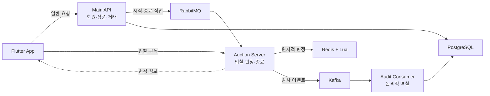

# Bid On

Redis Lua와 WebSocket을 활용해 동시 입찰, 실시간 상태 변경, 경매 종료 이후의 거래 흐름을 구현한 실시간 경매 서비스입니다.

[▶ Interactive Flow Console 실행하기](https://masha0118.github.io/Bid/) · [프로젝트 핵심 요약](docs/00-프로젝트-핵심-요약.md)

> 실제 서비스 공개를 준비 중인 프로젝트로 전체 운영 소스코드는 공개하지 않습니다. 이 저장소에는 비공개 원본 프로젝트에서 확인한 처리 구조, 기술적 의사결정, 검증 범위와 공개용 Flow Console을 정리했습니다.

## 공개 범위

이 저장소는 운영 소스코드, 실제 Flutter UI, API 주소, Redis Key, 메시지 채널, 인증 정보, 사용자 데이터와 운영 로그를 포함하지 않습니다. Flow Console의 사용자·금액·시간·Version은 모두 설명용 가상 값입니다. 자세한 기준은 [소스코드 공개 정책](소스코드-공개-정책.md)에서 확인할 수 있습니다.

## 해결한 핵심 문제

### 1. 동시 입찰 상태의 일관성

Redis에서 실행되는 Lua 로직 안에서 입찰 조건을 확인하고 최고가·최고 입찰자·입찰 횟수·종료 시각 변경 여부·Version과 런타임 상태를 한 번에 반영합니다. 검증과 변경 사이에 다른 요청이 끼어들지 않게 하는 범위는 Redis 내부 상태까지입니다. WebSocket 전파와 Kafka 감사 이벤트는 Lua 실행이 끝난 뒤 이어지는 별도 후속 처리입니다.

[동시 입찰 처리 상세 문서](docs/04-동시-입찰-처리.md)

### 2. 실시간 이벤트의 중복과 누락

화면 최초 진입 시 전체 상태를 조회하고 이후에는 WebSocket으로 바뀐 경매 정보만 받습니다. 이미 처리한 Version은 무시하고, 바로 다음 Version은 반영하며, 중간 Version이 비면 전체 상태를 다시 조회합니다. 늦게 도착한 전체 조회 응답도 현재 화면보다 오래된 Version이면 반영하지 않습니다.

[실시간 상태 동기화 상세 문서](docs/05-실시간-상태-동기화.md)

### 3. 경매 종료의 중복과 실패

종료 작업은 경매별 잠금을 얻고 기존 종료 결과를 먼저 확인한 뒤 최종 낙찰 정보를 Main API로 전달합니다. 같은 결과의 반복 요청은 기존 거래로 수렴시키고, 후속 거래 반영이 실패하면 성공 전에 런타임 상태를 지우지 않아 재처리에 필요한 근거를 남깁니다. 실제 장애 환경에서 자동 복구가 완료됐다고 주장하지 않으며 통합 검증은 추가 과제입니다.

[경매 종료와 복구 상세 문서](docs/06-경매-종료와-복구.md)

## Interactive Flow Console

실제 Flutter 화면을 공개하지 않고 실시간 경매 백엔드의 처리 순서를 공개용 가상 데이터로 시각화한 정적 도구입니다. 정상 입찰, 두 사용자의 동시 입찰, 마감 직전 자동 연장, WebSocket 이벤트 누락과 상태 복구, 경매 종료 중복 요청 차단, 거래 생성 실패 후 재처리 흐름을 선택해 볼 수 있습니다.

> 실제 운영 모니터링 화면이나 Flutter 앱 UI가 아닙니다. 비공개 원본 프로젝트의 처리 구조를 공개 가능한 가상 데이터로 재구성한 기술 시연 화면입니다.

아직 Pages가 활성화되지 않은 환경에서는 [Flow Console 로컬 실행 방법](flow-console/README.md#실행-방법)을 이용할 수 있습니다. 시나리오는 `?scenario=concurrent-bid` 같은 Query Parameter로 바로 열 수 있습니다.

## 시스템 아키텍처 요약

RabbitMQ는 미래 시점의 시작·종료 작업을 전달하고 Kafka는 이미 발생한 입찰 결과를 감사 기록으로 남깁니다. Audit Consumer는 논리적으로 분리해 표시했으며 별도 서버라는 의미는 아닙니다. 정적 전체 구조는 [시스템 아키텍처](docs/02-시스템-아키텍처.md), 시간 순서별 처리는 Flow Console에서 확인할 수 있습니다.

## 구현 및 검증 범위

| 영역 | 공개 문서 기준 상태 |
|---|---|
| Redis Lua 입찰 판정·자동 연장 | 코드에서 구현 확인 · 테스트 코드 확인 |
| WebSocket Version·중복·누락 판정 | 코드에서 구현 확인 · 테스트 코드 확인 |
| 종료 잠금·낙찰 거래 중복 방지 | 코드에서 구현 확인 · 테스트 코드 확인 |
| Flow Console의 6개 시나리오 | 흐름 재구성 · 테스트 실행 확인 |
| 실제 네트워크·장애·동시 부하 | 추가 검증 필요 |

원본 프로젝트의 자동화 테스트는 관련 코드의 존재만 확인했으며 이번 공개 저장소 작업에서 실행하지 않았습니다. 이번에 직접 실행한 것은 Flow Console의 type-check, 딥링크 테스트와 정적 빌드입니다. 두 범위를 섞어 검증 완료로 표현하지 않습니다.

## 상세 기술 문서

- [프로젝트 핵심 요약](docs/00-프로젝트-핵심-요약.md) · [프로젝트 개요](docs/01-프로젝트-개요.md)
- [시스템 아키텍처](docs/02-시스템-아키텍처.md) · [경매 도메인 규칙](docs/03-경매-도메인-규칙.md)
- [동시 입찰 처리](docs/04-동시-입찰-처리.md) · [실시간 상태 동기화](docs/05-실시간-상태-동기화.md)
- [경매 종료와 복구](docs/06-경매-종료와-복구.md) · [메시징과 데이터](docs/07-메시징과-데이터.md)
- [보안](docs/08-보안.md) · [테스트](docs/09-테스트.md)
- [기능 상태](docs/10-기능-상태.md) · [한계와 개선](docs/11-한계와-개선.md)
- [Flow Console 설계와 공개 기준](docs/12-flow-console.md) · [기술 결정 기록](docs/decisions/ADR-001-입찰-동시성-처리.md)

## 현재 한계와 추가 검증

Redis와 PostgreSQL은 하나의 분산 트랜잭션이 아니며, Redis 재시작·브로커 장애·네트워크 단절·다중 인스턴스 전환을 함께 다루는 통합 시험이 필요합니다. Flow Console은 구조를 설명하는 정적 재생 도구이므로 처리 시간이나 동시 사용자 수를 증명하지 않습니다. 자세한 과제는 [한계와 개선](docs/11-한계와-개선.md)에 구분했습니다.

소스 공개 판단과 코드 리뷰 범위는 [Source Code Policy](소스코드-공개-정책.md)를 따릅니다.
