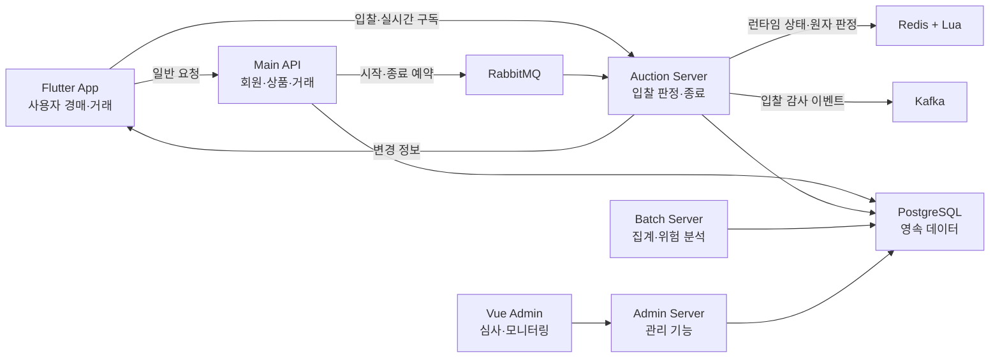

# 실시간 경매 시스템 구축

실시간 입찰, 낙찰 이후 거래, 관리자 검토와 위험 분석을 하나의 흐름으로 연결한 경매 서비스입니다.

> 실제 서비스 공개를 준비 중인 프로젝트로, 서비스 보호와 보안을 위해 전체 소스코드는 공개하지 않습니다. 이 저장소에는 프로젝트 구조, 기술적 의사결정, 문제 해결 과정, 테스트 범위와 시연 자료를 정리했습니다.

채용 검토용으로 핵심 내용을 한 문서에 압축한 [프로젝트 최종 요약](채용담당자용-프로젝트-최종본.md)을 먼저 읽어보실 수 있습니다.

## 왜 소스코드를 공개하지 않나요?

원본 저장소에는 인증·외부 연동·인프라 구성과 경매 정책이 함께 들어 있습니다. 이 저장소는 구현 코드를 복제하지 않고, 확인 가능한 설계와 검증 범위만 설명합니다. 자세한 기준은 [소스코드 공개 정책](소스코드-공개-정책.md)에 있습니다.

## 해결하려던 문제

경매는 여러 사용자가 같은 최고가를 동시에 바꾸고, 그 결과를 여러 화면과 영속 데이터에 일관되게 반영해야 합니다. OurBid는 다음 문제를 중심으로 설계했습니다.

- 동시 입찰에서 최고가·최고 입찰자·입찰 이력·종료 시각이 어긋나지 않게 판정
- WebSocket 이벤트의 중복, 늦은 도착, 중간 누락에 대응
- 종료 요청이 반복되어도 낙찰 거래가 중복 생성되지 않도록 처리
- 실시간 상태와 영속 데이터의 책임을 나누고 실패 후 재처리 가능성을 유지
- 관리자 심사와 Batch 위험 분석으로 사용자 기능과 관리 기능을 분리

## 담당 범위

현재 저장소의 Git 이력과 코드 기준으로 사용자 앱, Main API, 실시간 경매 서버, 관리자 서버·웹, Batch 서버를 함께 개발했습니다. 공개 문서에서는 개인별 기여율을 별도로 증명할 수 없어 수치로 표현하지 않습니다.

## 주요 사용자 흐름

1. 사용자가 상품과 경매 조건을 등록합니다.
2. 예약 메시지가 경매 시작·종료 작업을 전달합니다.
3. 입찰 요청은 Redis에서 실행되는 Lua 로직으로 검증과 상태 변경을 한 번에 처리합니다.
4. 변경된 정보는 WebSocket으로 전달되고, 감사 이벤트는 Kafka 경로로 기록됩니다.
5. 종료 시 최종 입찰 결과를 확인하고 Main API가 상품 상태와 거래를 반영합니다.
6. 거래·채팅·알림이 이어지고, 관리자는 신고·분쟁·광고·위험 분석 결과를 검토합니다.

## Architecture

상세 흐름은 [시스템 아키텍처](docs/02-시스템-아키텍처.md)에서 확인할 수 있습니다.

## 핵심 기술 문제와 해결

### 1. 동시에 들어오는 입찰

조회와 변경을 분리하지 않고 Redis에서 실행되는 Lua 안에서 경매 상태, 입찰자 조건, 최소 입찰가를 확인한 뒤 최고가·최고 입찰자·입찰 횟수·자동 연장·버전을 함께 변경합니다. WebSocket 전파와 Kafka 발행은 이 원자 처리 이후의 별도 후속 작업입니다. 자세한 내용은 [동시 입찰 처리](docs/04-동시-입찰-처리.md)에 정리했습니다.

### 2. 실시간 화면의 순서와 누락

클라이언트는 최초 전체 상태를 조회한 뒤 WebSocket으로 바뀐 값만 반영합니다. 버전이 이미 처리한 범위면 무시하고, 중간 버전이 비면 REST 전체 조회를 요청합니다. 이 판정 로직과 중복·누락·늦은 REST 응답 상황의 단위 테스트가 존재합니다. 자세한 내용은 [WebSocket 실시간 반영](docs/05-실시간-상태-동기화.md)을 참고하세요.

### 3. 경매 종료와 중복 거래

종료 작업은 경매별 잠금을 획득하고 기존 종료 결과를 먼저 확인합니다. Main API는 상품 행 잠금과 기존 거래 조회를 이용해 같은 낙찰 결과의 반복 요청을 기존 거래로 수렴시킵니다. 후속 반영이 실패하면 경매 서버는 런타임 상태를 즉시 삭제하지 않아 다시 처리할 여지를 남깁니다. 자세한 내용은 [경매 종료와 복구](docs/06-경매-종료와-복구.md)에 있습니다.

### 4. 서로 다른 메시징 책임

RabbitMQ는 미래 시점의 경매 시작·종료 작업 전달에, Kafka는 입찰 성공·실패 감사 이벤트의 비동기 기록에 사용합니다. 두 경로의 실패 처리와 현재 한계는 [메시징과 데이터](docs/07-메시징과-데이터.md)에 구분했습니다.

## 확인한 범위

| 영역 | 코드 확인 | 자동화 테스트 코드 | 이번 문서 작업에서 실행 |
|---|---:|---:|---:|
| Redis Lua 입찰 규칙 | 예 | 예 | 미실행 |
| 경매 종료 중복 방지·실패 시 상태 유지 | 예 | 예 | 미실행 |
| WebSocket 버전·중복·누락 판정 | 예 | 예 | 미실행 |
| Kafka ACK·재시도·중복 소비 | 예 | 예 및 통합 테스트 | 미실행 |
| JWT·내부 요청 인증·요청 제한 | 예 | 일부 테스트 | 미실행 |
| Batch 위험 분석 | 예 | 다수 단위 테스트 | 미실행 |

원본 프로젝트를 읽기 전용으로 보존한다는 이번 작업 조건 때문에 빌드 산출물을 만드는 테스트 명령은 실행하지 않았습니다. 따라서 이 저장소는 테스트의 존재와 검증 의도를 설명하며, 이번 분석에서의 성공 건수나 성공률을 주장하지 않습니다. 상세 표는 [테스트](docs/09-테스트.md)에 있습니다.

## 화면과 시연 자료

- 화면: [스크린샷 촬영 가이드](screenshots/README.md) — 공개 전 개인정보 제거 후 추가
- 영상: [시연 촬영 대본](demo/README.md) — 실제 영상 링크는 촬영 후 이 위치에 추가

## 기술 문서

- [프로젝트 개요](docs/01-프로젝트-개요.md)
- [시스템 아키텍처](docs/02-시스템-아키텍처.md)
- [경매 도메인 규칙](docs/03-경매-도메인-규칙.md)
- [동시 입찰 처리](docs/04-동시-입찰-처리.md)
- [WebSocket 실시간 반영](docs/05-실시간-상태-동기화.md)
- [경매 종료와 복구](docs/06-경매-종료와-복구.md)
- [메시징과 데이터](docs/07-메시징과-데이터.md)
- [보안](docs/08-보안.md)
- [테스트](docs/09-테스트.md)
- [기능 상태](docs/10-기능-상태.md)
- [추가 검증 및 개선 과정](docs/11-한계와-개선.md)
- [기술 결정 기록](docs/decisions/ADR-001-입찰-동시성-처리.md)

## 현재 한계와 개선 방향

Redis와 PostgreSQL 사이의 완전한 단일 트랜잭션은 제공하지 않으며, Redis 재시작·다중 인스턴스·네트워크 단절을 포함한 장애 복구 시나리오는 추가 통합 검증이 필요합니다. WebSocket 재연결과 버전 누락 판정은 코드와 단위 테스트로 확인했지만 실제 네트워크 조건의 반복 시험은 별도 과제입니다. 자세한 내용은 [추가 검증 및 개선 과정](docs/11-한계와-개선.md)에 정리했습니다.
