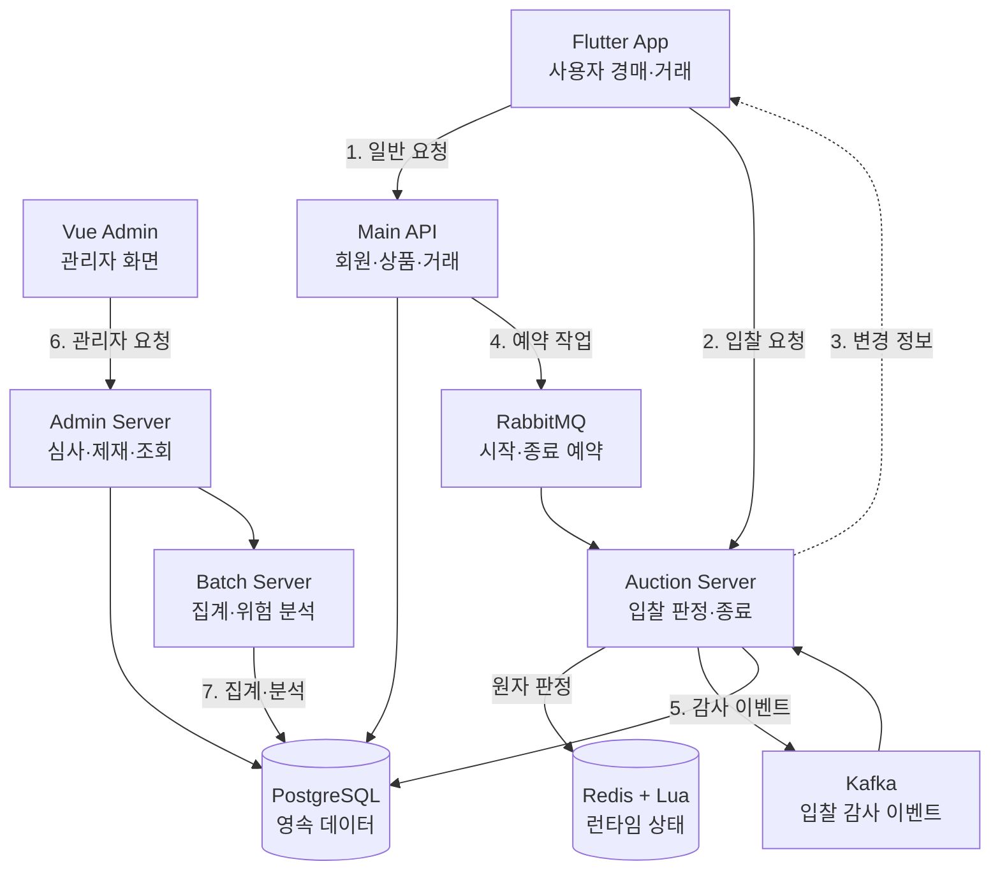

# 시스템 아키텍처

전체 흐름은 [Mermaid 원본](../diagrams/시스템-아키텍처.mmd)에도 제공합니다.

## 구성요소와 책임

| 구성요소 | 책임·요청 유형 | 연결 | 데이터 성격 | 처리 방식 |
|---|---|---|---|---|
| Flutter App | 사용자 조회, 입찰, 거래, 채팅 | Main API, Auction Server | 화면 상태 | 동기 요청 + 실시간 수신 |
| Vue Admin | 관리자 심사·모니터링 화면 | Admin Server | 화면 상태 | 동기 요청 |
| Main API | 회원·상품·거래·알림 | PostgreSQL, RabbitMQ, Auction Server | 영속 데이터 중심 | 동기 + 예약 발행 |
| Auction Server | 입찰 판정, 실시간 전파, 종료 | Redis, PostgreSQL, RabbitMQ, Kafka, Main API | 런타임 상태 + 감사 데이터 | 동기 판정 + 비동기 후속 처리 |
| Admin Server | 광고·신고·분쟁·제재·지표 조회 | PostgreSQL, Batch Server, Auction Server | 영속 조회·관리 상태 | 동기 요청 |
| Batch Server | 지표와 위험 분석 | PostgreSQL | 집계·분석 결과 | 예약 및 수동 실행 |
| PostgreSQL | 상품·거래·감사·관리·집계 데이터 | 각 서버 | 영속 데이터 | 트랜잭션 |
| Redis + Lua | 경매 상태와 원자적 입찰 판정 | Auction Server | 런타임 상태 | 동기·원자 실행 |
| WebSocket | 변경된 경매 정보 전달 | Auction Server, App | 실시간 메시지 | 비동기 수신 |
| RabbitMQ | 예약된 시작·종료 작업 | Main API, Auction Server | 작업 메시지 | 비동기 |
| Kafka | 입찰 성공·실패 감사 이벤트 | Auction Server | 이벤트 스트림 | 비동기 |

## 흐름 구분

1. 일반 서비스 요청: Flutter App → Main API → PostgreSQL
2. 실시간 입찰: Flutter App → Auction Server → Redis Lua
3. 결과 전파: Auction Server → Redis Pub/Sub·WebSocket → Flutter App
4. 시작·종료 예약: Main API → RabbitMQ → Auction Server
5. 입찰 감사: Auction Server → Kafka → 감사 데이터 저장
6. 관리자 요청: Vue Admin → Admin Server → PostgreSQL 및 내부 조회
7. Batch 집계: Batch Server → PostgreSQL 조회·결과 저장 → Admin Server 조회

## 경계와 한계

Lua가 보장하는 원자 범위는 Redis 내부 검증과 상태 변경까지입니다. Main API 동기화, WebSocket 전파, 알림과 Kafka 발행은 후속 처리이므로 실패와 재처리를 별도로 다뤄야 합니다. PostgreSQL은 장기 보관과 거래의 기준이며, Redis 상태와 하나의 분산 트랜잭션으로 묶여 있지는 않습니다.
