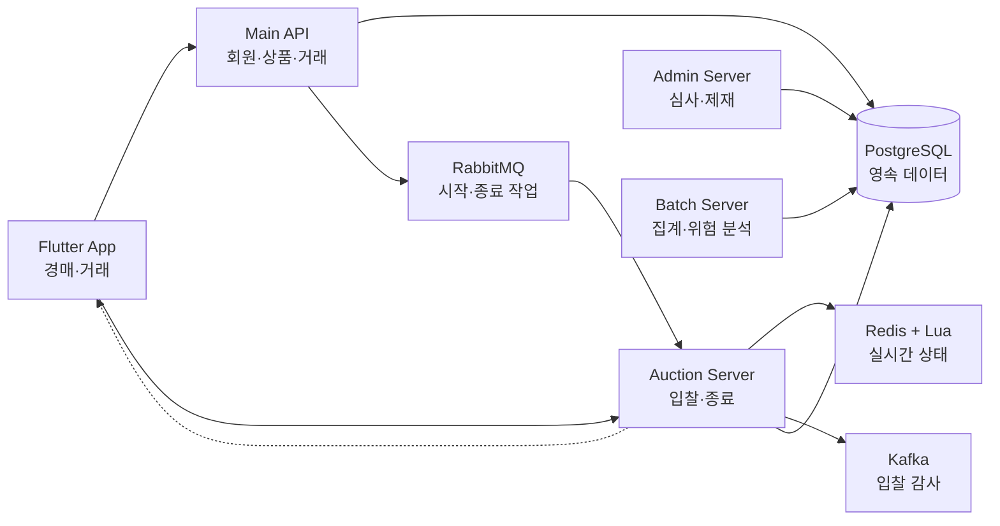

# 실시간 경매 시스템 프로젝트 최종 요약

> 실시간 입찰부터 낙찰 이후 거래, 관리자 검토와 위험 분석까지 연결한 경매 서비스입니다. 서비스 보호와 보안을 위해 전체 소스코드는 공개하지 않으며, 이 문서는 실제 코드와 테스트에서 확인한 설계·구현 범위를 압축해 설명합니다.

## 1. 어떤 프로젝트인가요?

실시간 경매 시스템은 사용자가 상품을 등록하고 여러 참여자가 실시간으로 입찰한 뒤, 낙찰 결과가 거래·채팅·알림으로 이어지는 경매 서비스입니다.

사용자 기능만 구현하는 데 그치지 않고 다음 흐름을 하나의 시스템으로 연결했습니다.

```text
상품 등록
→ 경매 시작 예약
→ 실시간 입찰
→ 마감 임박 자동 연장
→ 낙찰 또는 유찰
→ 거래·채팅·알림
→ 신고·분쟁·관리자 검토
→ 입찰 데이터 집계와 위험 분석
```

구성은 Flutter 사용자 앱, Vue 관리자 화면, Main API, 실시간 경매 서버, 관리자 서버와 Batch 서버로 나뉩니다.

## 2. 가장 중요하게 해결한 문제

### 동시에 들어오는 입찰을 어떻게 정확하게 처리할 것인가

현재 최고가가 10,000원일 때 두 사용자가 거의 동시에 다른 금액을 입찰하면, 단순한 조회 후 저장 방식에서는 최고가와 최고 입찰자뿐 아니라 입찰 횟수, 입찰 기록과 종료 시각도 서로 어긋날 수 있습니다.

이를 해결하기 위해 실시간 경매 상태를 Redis에 두고, Redis에서 실행되는 Lua 안에서 다음 작업을 한 번에 처리했습니다.

- 경매 시작·종료 상태 확인
- 판매자 본인 입찰과 취소 후 재입찰 제한
- 현재 최고 입찰자의 연속 입찰 제한
- 현재가와 입찰 단위를 이용한 최소 입찰가 확인
- 최고가와 최고 입찰자 변경
- 입찰 기록·참여자·입찰 횟수 저장
- 마감 임박 시 종료 시각 자동 연장
- 경매 이벤트 버전 증가

이 방식은 Redis 내부의 검증과 변경 사이에 다른 입찰이 끼어드는 것을 막습니다.

다만 WebSocket 전파, PostgreSQL 동기화, 알림과 Kafka 발행은 Lua의 원자 처리 범위가 아닙니다. 해당 작업은 입찰 판정 후 별도 후속 경로로 분리했습니다.

### 실시간 화면에서 중복·누락·늦은 이벤트를 어떻게 처리할 것인가

WebSocket 메시지는 네트워크 상황에 따라 중복되거나 늦게 도착하고, 일부가 누락될 수 있습니다. REST 응답이 더 최신인 WebSocket 상태보다 늦게 도착하는 상황도 고려해야 했습니다.

서버는 입찰 상태를 바꿀 때 경매 버전을 함께 증가시키고, Flutter 앱은 마지막으로 반영한 버전과 새 이벤트의 버전을 비교합니다.

- 이미 처리한 버전: 무시
- 바로 다음 버전: 바뀐 값만 반영
- 중간 버전 누락: REST로 전체 상태 재조회
- 현재 화면보다 오래된 REST 응답: 무시

따라서 정상적인 실시간 이벤트에서는 상품 전체를 매번 다시 조회하지 않고, 순서가 끊긴 경우에만 전체 상태를 다시 가져옵니다.

### 경매 종료가 반복되어도 거래가 중복 생성되지 않게 할 것인가

예약 메시지 재전달, 서버 재시작 또는 주기적 재탐색 때문에 같은 경매의 종료 작업이 여러 번 실행될 수 있습니다.

경매 서버는 다음 순서로 종료를 처리합니다.

1. 경매별 종료 잠금 획득
2. 이미 저장된 종료 결과 확인
3. 최종 입찰자와 금액 결정
4. Main API에 낙찰 또는 유찰 결과 전달
5. 거래와 상품 상태 반영
6. 결과 요약과 입찰 기록 저장
7. 성공한 경우에만 Redis 런타임 상태 정리

Main API에서는 상품 데이터를 잠근 뒤 기존 낙찰 거래를 먼저 조회합니다. 같은 낙찰 결과가 반복되면 기존 거래를 반환하고, 다른 낙찰자나 금액이 들어오면 안전하게 거절합니다.

Main API의 후속 처리가 실패하면 경매 서버가 Redis 상태를 바로 삭제하지 않으므로 주기적 재탐색을 통해 다시 처리할 수 있습니다.

## 3. 시스템 구성과 기술 선택



| 기술 | 프로젝트에서 맡은 책임 |
|---|---|
| Redis + Lua | 실시간 경매 상태와 동시 입찰의 원자적 판정 |
| WebSocket | 변경된 가격·입찰·종료 상태를 사용자 화면에 전달 |
| RabbitMQ | 미래 시점의 경매 시작·종료 작업 전달 |
| Kafka | 입찰 성공·실패 감사 이벤트의 비동기 기록 |
| PostgreSQL | 사용자·상품·거래·감사·관리 데이터 영속화 |
| Spring Batch | 입찰 관계 통계와 위험 사용자 분석 |

RabbitMQ와 Kafka는 모두 메시징 기술이지만 같은 목적으로 사용하지 않았습니다. RabbitMQ는 정해진 시점에 수행할 작업을 전달하고, Kafka는 이미 발생한 입찰 결과를 감사 기록으로 남기는 역할을 담당합니다.

## 4. 함께 구현한 서비스 영역

### 사용자 서비스

- 회원 인증과 소셜 로그인 연동 구조
- 상품 등록·수정과 이미지 검증
- 실시간 입찰, 입찰 취소와 자동 연장
- 낙찰 이후 거래 상태 관리
- 채팅, 알림, 후기와 사용자 신뢰도
- 신고·분쟁과 계정 제재 정책

### 관리자 서비스

- 광고 신청과 심사
- 상품·신고·분쟁 검토
- 회원 상태와 제재 관리
- 관리자 작업 감사 기록
- 서비스 지표와 위험 분석 결과 조회

### Batch 분석

입찰 데이터를 이용해 판매자와 입찰자의 반복 관계, 참여 집중도와 거래 결과 등을 집계하고, 계정쌍 및 회원 단위의 위험 분석 결과를 생성하는 Batch 흐름을 구현했습니다.

정확한 내부 계산 기준은 악용 가능성과 정책 변경 가능성을 고려해 공개하지 않습니다.

## 5. 보안에서 확인한 내용

- Spring Security와 JWT 기반의 서버 세션 없는 인증
- 사용자·관리자 인증 흐름 분리
- BCrypt 비밀번호 저장
- 내부 서버 요청을 위한 별도 인증
- 구매자·판매자 등 데이터 소유권 확인
- Redis 기반 요청 횟수 제한과 장애 시 대체 카운터
- 인증 실패와 권한 부족을 일관된 JSON 응답으로 구분
- 업로드 파일의 확장자, 콘텐츠 유형과 실제 파일 시그니처 검증
- CORS 허용 출처 설정 분리

실제 비밀값, 인증 헤더, 내부 주소, 보안 임계값과 API 경로는 공개 자료에서 제거했습니다.

## 6. 구현과 검증 범위

| 영역 | 코드에서 확인 | 테스트 코드에서 확인 | 이번 문서 작성 중 실행 |
|---|---:|---:|---:|
| Redis Lua 입찰 규칙 | O | O | X |
| 입찰 취소·자동 연장 | O | O | X |
| WebSocket 중복·누락·순서 처리 | O | O | X |
| 경매 종료 중복 방지 | O | O | X |
| 낙찰 거래 중복 방지 | O | O | X |
| Kafka ACK·재시도·중복 소비 | O | O | X |
| JWT·내부 요청 인증·요청 제한 | O | 일부 확인 | X |
| Batch 위험 분석 | O | O | X |

원본 프로젝트를 읽기 전용으로 보존해야 했기 때문에 이번 포트폴리오 작성 과정에서는 빌드 산출물을 만드는 테스트 명령을 실행하지 않았습니다. 따라서 테스트 성공률이나 처리 성능을 임의로 주장하지 않습니다.

## 7. 현재 한계와 다음 검증 과제

### Redis와 PostgreSQL의 상태 차이

Redis의 즉시 상태 변경과 PostgreSQL 영속화는 하나의 분산 트랜잭션이 아닙니다. 후속 동기화가 장시간 실패했을 때의 재처리와 데이터 비교를 더 강화할 필요가 있습니다.

### 장애 복구 통합 시험

Redis 상태 복원, 만료 경매 재탐색과 감사 이벤트 재전송 코드는 존재하지만 Redis 재시작, 브로커 장애와 네트워크 단절을 묶은 전체 시험 결과는 추가 확인이 필요합니다.

### 실제 네트워크에서의 WebSocket 검증

버전 처리 단위 테스트는 존재하지만 장시간 연결, 반복 재연결, 다중 서버 전환과 이벤트 지연을 포함한 통합 시험이 필요합니다.

### 비동기 실패 저장 방식

Kafka 발행 실패 이벤트의 로컬 보관은 단일 서버 복구에는 도움이 되지만 여러 서버가 공유하는 저장 방식은 아닙니다. 공유 가능한 영속 작업 로그나 Outbox 계열 구조를 추가로 검토할 수 있습니다.

### AI 기능 품질

AI 상품 등록과 고객센터 관련 코드가 존재하지만 현재 작업 중인 부분과 별도 품질 평가가 필요한 부분이 있어 핵심 완성 기능으로 주장하지 않습니다.

## 8. Git 기록에서 확인한 개발 흐름

- 2025년 1월: Main API, 예약 메시지, 별도 경매 서버와 실시간 입찰 구성
- 2025년 상반기: 상품·채팅·프로필과 Flutter 앱 확장
- 2026년 6월: PostgreSQL 전환, 경매 정책, 거래·분쟁·관리자·Batch 기능 보완
- 2026년 7월: WebSocket 버전 처리, 비동기 입찰 후속 작업, 종료 안정화와 모니터링 개선

단순히 기능을 추가하는 데 그치지 않고 동시성, 실패 복구, 데이터 소유권, 반복 쿼리와 실시간 상태 일관성을 지속적으로 보완한 이력을 확인했습니다.

## 9. 한 문장으로 정리하면

실시간 경매 시스템은 **여러 사용자가 동시에 상태를 변경하는 실시간 경매에서 정확한 입찰 판정, 화면 동기화, 종료 중복 방지와 실패 후 재처리를 어떻게 설계할지 고민하고 구현한 프로젝트**입니다.

더 자세한 근거가 필요한 경우 [전체 문서 목록](README.md#기술-문서)에서 주제별 설계 문서를 확인할 수 있습니다.
